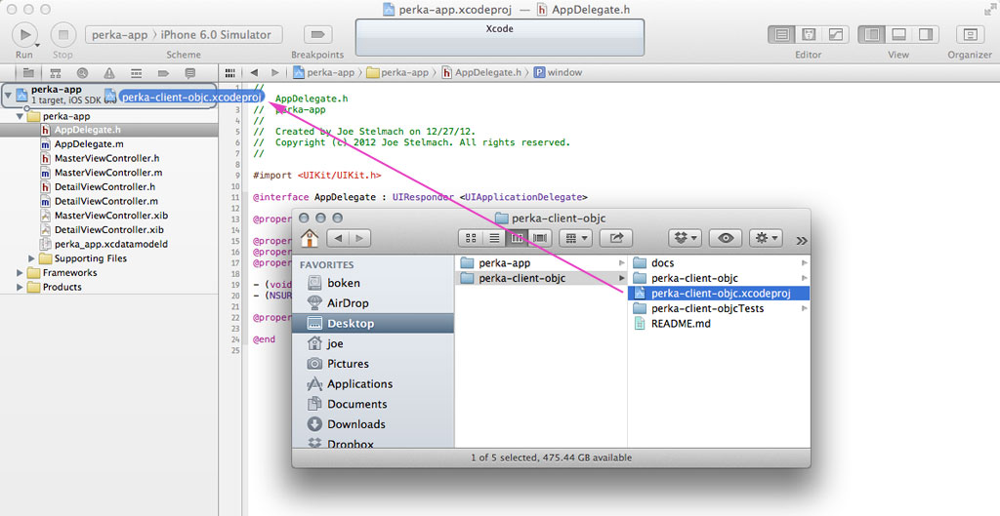

## Perka Objective-C Client Library

### Installation

1. Create a new XCode project to make use of the perka client library.  We'll refer to this project as perka-app, housed in the directory $WORKSPACE.

2. Clone the perka-client-objc project next to perka-app.
    git clone git@github.com:perka/perka-client-objc.git $WORKSPACE/perka-client-objc

3. Drag the perka-client-objc.xcodeproj file from the Finder onto the perka-app project in XCode:

   